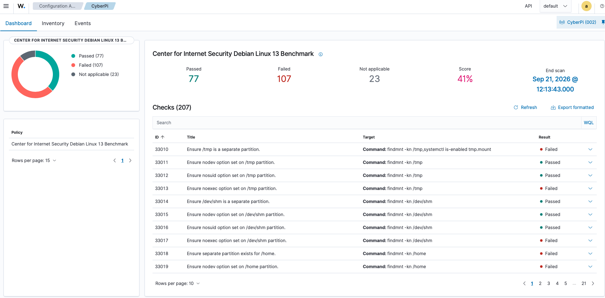
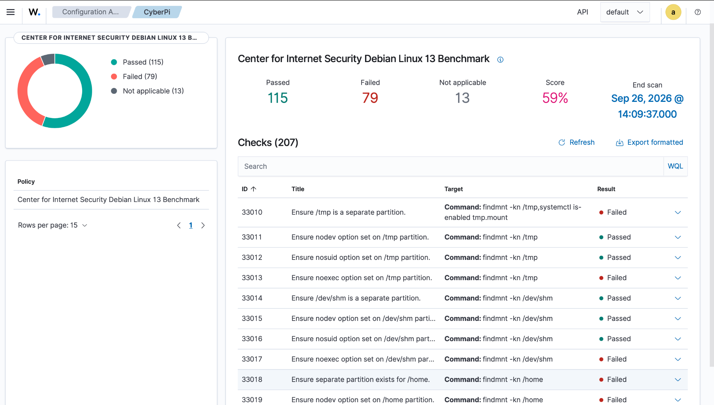

# CyberPi CIS Hardening

Risk-based hardening of a Raspberry Pi 5 running Debian GNU/Linux 13, assessed with Wazuh Security Configuration Assessment (SCA).

## Results

The selected hardening phase was completed on September 26, 2026.

| Assessment | Passed | Failed | Not applicable | Reported score |
| --- | ---: | ---: | ---: | ---: |
| Initial baseline | 77 | 107 | 23 | 41% |
| Final assessment | 115 | 79 | 13 | 59% |

The reported score increased by 18 percentage points, with 38 additional checks passing. Applicability counts also changed between assessments.

These results describe the Wazuh SCA policy assessment. They do not establish full CIS compliance or certification.

### Baseline Assessment Evidence

September 21, 2026: 41% reported score, with 77 passed, 107 failed, and 23 not applicable.

### Final Assessment Evidence

## Environment

- Hardware: Raspberry Pi 5
- Operating system: Debian GNU/Linux 13 (trixie)
- Architecture: ARM64
- Monitoring: Wazuh agent 4.14.7
- Assessment policy: cis_debian13.yml
- Lab services: Pi-hole and Tailscale

## Work Completed

- Hardened SSH access and inspected the effective configuration.
- Configured UFW firewall rules while preserving required lab services.
- Applied password quality, password history, and account-aging settings.
- Configured persistent, compressed journald logging.
- Recorded privileged commands through sudo logging.
- Verified Wazuh agent operation and completed a final SCA scan.

## Decisions and Troubleshooting

The project prioritized security improvements while preserving required functionality.

Outbound traffic and SSH forwarding were retained. Partitioning changes were deferred, and journald was selected as the logging approach.

Troubleshooting covered SSH configuration precedence, PAM profile selection, journald drop-in ordering, and a recorded password-quality scanner discrepancy. Remaining failed checks require individual classification.

## Documentation

- [System inventory and hardening summary](docs/system-inventory.md)

## Project Status

The selected hardening phase and portfolio evidence package are complete. This repository documents the baseline and final assessment results, configuration evidence, troubleshooting findings, and intentional exceptions.

The final assessment reported 79 failed checks; these remain subject to individual review. The exact benchmark revision/profile and other documentation gaps are listed in the system inventory. This project does not claim full CIS compliance.

See the [evidence index](docs/system-inventory.md#evidence-index) for all seven supporting screenshots.